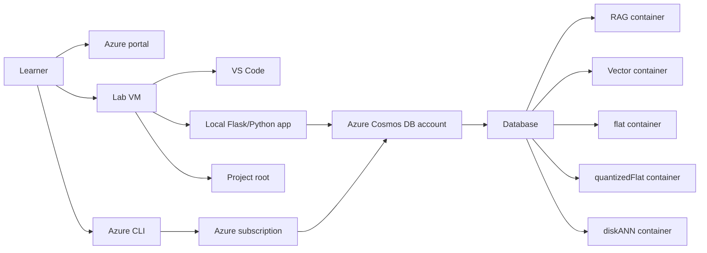

# Getting Started

### Estimated Duration: 30 Minutes

## Scenario

In this workshop, you are an Azure developer building an AI-ready document retrieval backend on Azure Cosmos DB for NoSQL. You will begin by creating a retrieval-augmented generation (RAG) document store for chunked content, then extend the solution with semantic search by storing vectors and querying with `VectorDistance`, and finally compare multiple vector index strategies to understand the trade-offs between accuracy, latency, and RU consumption. The lab environment is intentionally prepared so you can focus on Azure resource configuration, Python implementation, and Cosmos DB behavior instead of spending time downloading files or building a project skeleton from scratch.

## Lab overview

This workshop is delivered as a guided build across three connected exercises:

1. **Exercise 1** establishes the Azure Cosmos DB for NoSQL foundation, reviews the staged starter files, and implements the core Python logic for storing and retrieving chunked RAG documents.
2. **Exercise 2** builds on the same account and database by enabling vector search, creating or validating a vector-enabled container, and testing semantic similarity queries.
3. **Exercise 3** extends the same solution again by comparing `flat`, `quantizedFlat`, and `diskANN` index strategies so you can measure performance and interpret trade-offs.

Because the exercises share one environment, the work you complete early in the lab directly supports the later tasks. Treat the lab as a single end-to-end implementation rather than three isolated demos.

## Objectives

By the end of this workshop, you will be able to:

- Sign in to the Azure portal and validate the staged lab environment.
- Locate the pre-staged project folders on the lab VM.
- Understand how the Cosmos DB account, database, and containers are used across the three exercises.
- Use Azure CLI and the Azure portal to work with Azure Cosmos DB for NoSQL.
- Explain how the lab progresses from RAG storage to semantic search and then to vector index optimization.

## Prerequisites

Before you begin, you should be comfortable with:

- Basic Azure portal navigation
- Running commands in Azure CLI
- Opening folders and files in Visual Studio Code
- Basic Python concepts such as editing functions and running scripts

The lab VM already includes the tools needed for the workshop, including Azure CLI, Python, Git, and Visual Studio Code.

## Sign in and environment access

Use the following credentials for your lab environment:

- **Azure username:** `<inject key="AzureAdUserEmail"></inject>`
- **Azure password:** `<inject key="AzureAdUserPassword"></inject>`
- **Subscription:** `<inject key="SubscriptionID"></inject>`
- **Tenant:** `<inject key="TenantID"></inject>`
- **Deployment ID:** **<inject key="DeploymentID" enableCopy="false"/>**

> [!Important]
> Keep your deployment ID available throughout the workshop. Some CloudLabs workflows and support checks use this value to identify your lab instance.

## Architecture

The workshop uses one Azure-based environment with a staged local development experience on the lab VM.



## Components used in this lab

### Azure Cosmos DB account

The workshop centers on a single Azure Cosmos DB for NoSQL account named `<inject key="cosmosAccountName"></inject>`. This account hosts the database and all containers used across the three exercises.

### Shared database

The shared database for the lab is `<inject key="databaseName"></inject>`. You will use this database across all exercises rather than creating a separate database for each scenario.

### Progressive container design

The containers are introduced progressively as the lab advances:

- `<inject key="ragContainerName"></inject>` stores chunked content for the RAG document store workflow.
- `<inject key="vectorContainerName"></inject>` supports semantic search and vector similarity queries.
- `<inject key="flatContainerName"></inject>`, `<inject key="quantizedContainerName"></inject>`, and `<inject key="diskAnnContainerName"></inject>` support the performance comparison exercise for vector indexing strategies.

### Lab VM and staged content

All starter files and sample content are pre-staged on the lab VM under the root folder `<inject key="projectRootPath"></inject>`. You will open this location early in the lab and work from the prepared folders instead of cloning repositories manually.

## Staged folder orientation

When you sign in to the lab VM, use File Explorer or Visual Studio Code to open the root lab folder:

`<inject key="projectRootPath"></inject>`

You should expect the staged content to be organized into exercise-aligned folders that map to the workshop flow:

- A folder for the RAG document store exercise
- A folder for the semantic search exercise
- A folder for the vector index performance exercise
- Supporting sample data and configuration files used by the local Python application

During the lab, you will inspect and edit the staged Python files rather than creating the solution from scratch.

> [!Tip]
> If a later exercise refers to files, functions, or sample content that you do not immediately recognize, first return to `<inject key="projectRootPath"></inject>` and confirm you opened the correct staged folder for that exercise.

## Recommended startup workflow

Follow this sequence before starting Exercise 1.

1. Sign in to the Azure portal at <https://portal.azure.com> using `<inject key="AzureAdUserEmail"></inject>` and `<inject key="AzureAdUserPassword"></inject>`.
2. Confirm you are working in subscription `<inject key="SubscriptionID"></inject>`.
3. Open the lab VM desktop tools and launch Visual Studio Code.
4. In Visual Studio Code, open the folder `<inject key="projectRootPath"></inject>`.
5. Review the staged subfolders so you understand which files belong to each exercise.
6. Open a terminal on the lab VM.
7. Sign in to Azure CLI.

```azurecli
az login
az account set --subscription <inject key="SubscriptionID"></inject>
az account show --output table
```

8. Keep the terminal open for the rest of the lab because later exercises use Azure CLI to inspect or update Azure Cosmos DB resources.

> [!Note]
> Azure Cosmos DB vector search can be enabled from the Azure portal by opening your Cosmos DB resource, selecting **Settings** > **Features**, and then enabling **Vector Search for NoSQL API**. Microsoft Learn also documents the equivalent CLI pattern using `az cosmosdb update` with the target resource group, account name, and the `EnableNoSQLVectorSearch` capability. You will use the approach specified in the exercise steps.

## How the exercises build on each other

### Exercise 1: RAG document store foundation

In Exercise 1, you will establish the working baseline for the workshop. This includes reviewing the starter project, confirming provider registration if needed, deploying or verifying the Cosmos DB foundation, configuring Microsoft Entra ID-based access, and implementing the Python logic that writes and reads chunked documents.

This exercise gives you the data model and application structure needed for the rest of the lab.

### Exercise 2: Semantic search with vectors

In Exercise 2, you will continue using the same Cosmos DB account and database, but now you will work with vector-aware container settings. Microsoft Learn documents that vector search requires a vector embedding policy and can use vector indexes to improve efficiency when calling `VectorDistance`. In this exercise, you will create or validate the vector-enabled container, complete the Python query logic, and test similarity search behavior through the staged app.

### Exercise 3: Query performance optimization

In Exercise 3, you will compare the three vector index types used in this workshop:

- `flat`
- `quantizedFlat`
- `diskANN`

According to Microsoft Learn, `flat` provides exact brute-force behavior, while `quantizedFlat` and `diskANN` can improve latency and RU efficiency for larger-scale vector search scenarios. You will use the prepared comparison workflow to observe how index choices affect execution time and cost characteristics.

## Azure portal and CLI orientation for this workshop

You will primarily use the following Azure surfaces during the lab:

- **Azure portal** for resource review and feature inspection
- **Azure CLI** for sign-in, subscription context, and selected Cosmos DB operations
- **Azure Cosmos DB Data Explorer** for inspecting databases, containers, and documents when directed in the exercises

Useful references for the upcoming tasks include:

- The Azure Cosmos DB account `<inject key="cosmosAccountName"></inject>`
- The database `<inject key="databaseName"></inject>`
- The lab deployment marker **<inject key="DeploymentID" enableCopy="false"/>**

## Success criteria before you continue

Before moving to Exercise 1, confirm that:

- You can sign in to the Azure portal.
- Azure CLI is authenticated successfully.
- The correct subscription is selected.
- You can open `<inject key="projectRootPath"></inject>` in Visual Studio Code.
- You understand that Exercises 2 and 3 build on the resources and code patterns introduced in Exercise 1.

## Summary

You are now oriented to the workshop environment and the end-to-end scenario. The lab VM contains the staged project content, the Azure subscription provides the target environment, and the three exercises build progressively from document storage to semantic search and finally to vector index performance analysis in Azure Cosmos DB for NoSQL. Continue to Exercise 1 to start implementing the document retrieval backend.

## After publishing

> [!Note] These steps run **after** you push the template to CloudLabs — they verify CloudLabs can actually serve this lab guide to candidates.

- **Verify docs-proxy access:** open Templates → your template → **Lab Guide Settings** in <https://admin.cloudlabs.ai> and confirm CloudLabs can reach this repo via the docs proxy. If the repo is private, configure GitHub access at the template level.
- **Verify inline questions and inline validations:** sign in to <https://admin.cloudlabs.ai>, open your template, and walk through one full lab run to confirm every `<question>` and `<validation step="..."/>` renders correctly. Fix any that don't resolve.
